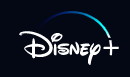
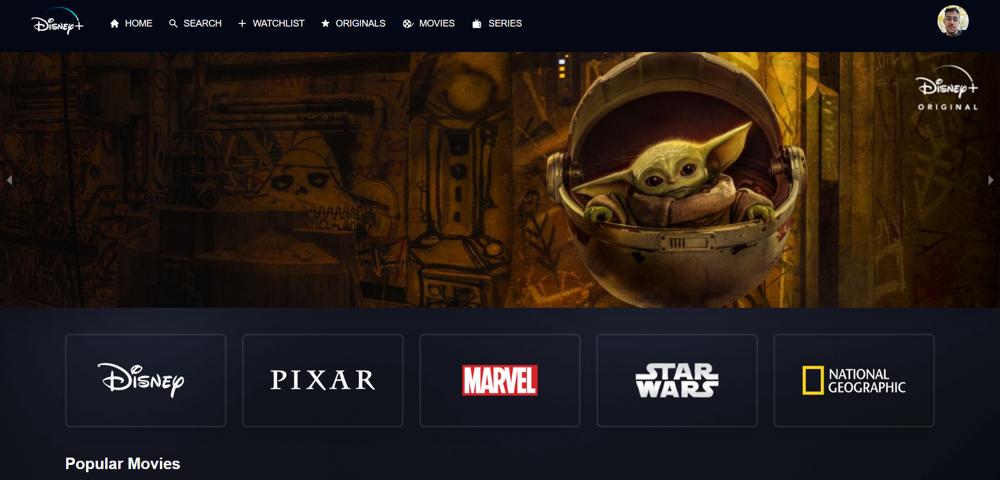

<h1 align="center">
  
</h1>

  <a href="#-techs">Techs</a>&nbsp;&nbsp;&nbsp;|&nbsp;&nbsp;&nbsp;
  <a href="#-about">About</a>&nbsp;&nbsp;&nbsp;|&nbsp;&nbsp;&nbsp;
  <a href="#-how-to">How to</a>&nbsp;&nbsp;&nbsp;

 

  

## ✨ Techs

This project is made using:

- [React](https://reactjs.org)
- [NextJS](https://nextjs.org/)
- [TailwindCSS](https://tailwindcss.com/)
- [HeroIcons](https://heroicons.com/)
- [TypeScript](https://www.typescriptlang.org/)
- [ESLint](https://eslint.org/)
- [Prettier](https://prettier.io/)
- [FirebaseV8](https://firebase.google.com/docs)

## 💻 About

Disney+ clone the an American subscription video on-demand

## 🚀 How to

- Clone the repository
- Install packages with `yarn` or `npm install`
- Run `yarn dev` or `npm run dev`
- Replace the environment variables on .env

Now you can access [`localhost:3000`](http://localhost:3000)

## Author

👤 **Nikson Rotondaro**

- Website: https://disney-plus-woad.vercel.app/
- Twitter: [https:\/\/twitter.com\/NoskinR](https://twitter.com/NoskinR)
- Github: [@NRotondaro](https://github.com/NRotondaro)
- LinkedIn: [https:\/\/www.linkedin.com\/in\/nikson-rotondaro\/](https://www.linkedin.com/in/nikson-rotondaro/)

## Show your support

Give a ⭐️ if this project helped you!

---
